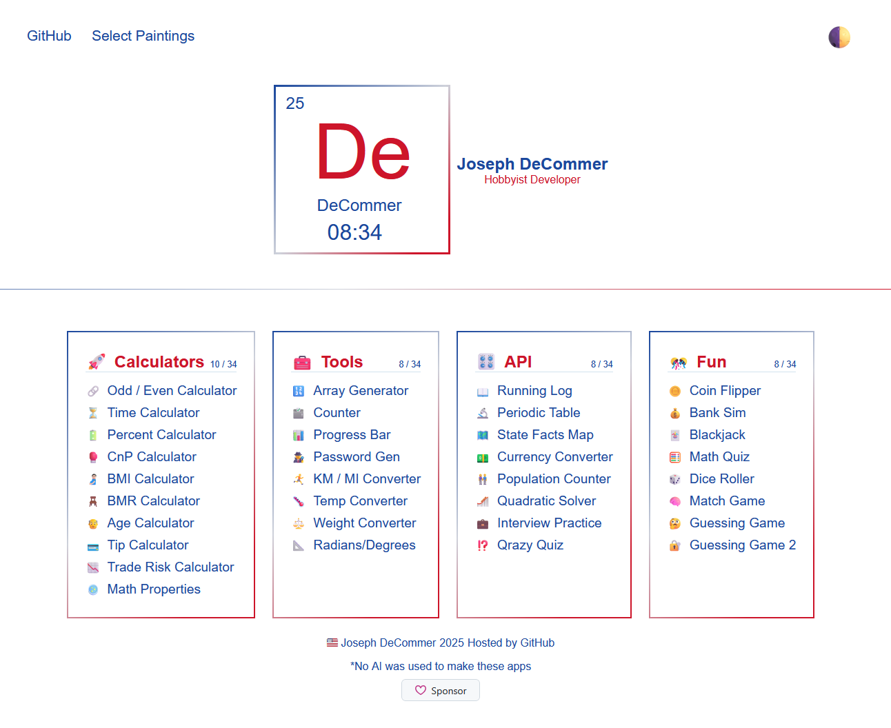

# Welcome to decommer.com

**Welcome to DeCommer.com: Your Ultimate Tool Hub!**

DeCommer.com is your go-to destination for a wide array of handy online tools designed to make your life easier and more efficient. Whether you're a student, a professional, or just someone who loves to learn, our platform offers a suite of apps tailored to meet your needs.

### Explore Our Features:

- **Math Quiz**: Challenge yourself with engaging math quizzes that help sharpen your skills and boost your confidence.
  
- **Quadratic Solver**: Solve complex quadratic equations effortlessly with our intuitive solver, perfect for students and math enthusiasts alike.

- **Periodic Table**: Dive into the world of chemistry with our interactive periodic table, complete with element details and properties at your fingertips.

- **Calculators Galore**: From age and BMI calculators to a currency converter, our extensive collection of calculators is designed to help you with everyday calculations and more specialized tasks.

At DeCommer.com, we believe that the right tools can transform the way you approach challenges. Whether you're tackling homework, preparing for exams, or just curious about the world around you, our apps are here to support you every step of the way.

### And more!

- **User-Friendly Interface**: Navigate our tools with ease, thanks to a clean and intuitive design.
  
- **Accessible Anytime, Anywhere**: Use our tools on any device, whether you’re at home, in class, or on the go.

- **Constantly Updated**: We regularly add new features and tools to ensure you always have access to the latest resources.

https://www.decommer.com
